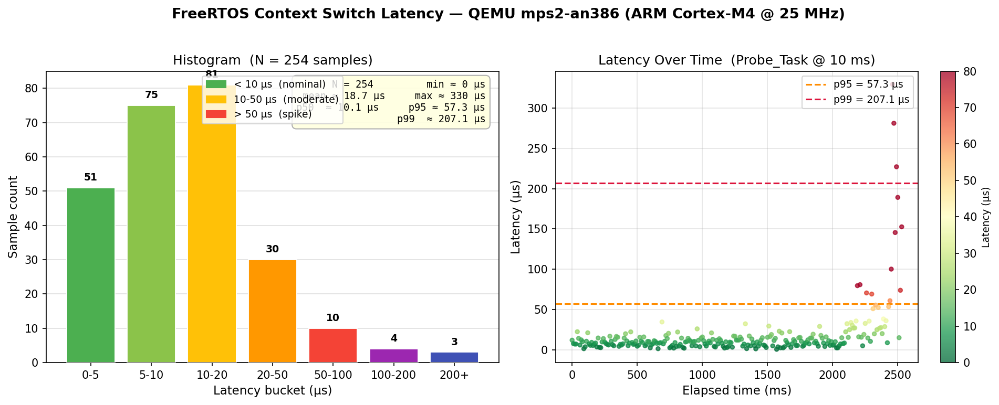

# RTOS Task Manager

[](LICENSE)
[](https://www.arm.com/products/silicon-ip-cpu/cortex-m/cortex-m4)
[](https://www.freertos.org/)
[](https://www.autosar.org/)
[](https://github.com/pawanct08/rtos-task-manager/actions/workflows/ci.yml)

A production-grade **priority-based preemptive task manager** built on FreeRTOS for ARM Cortex-M4, featuring AUTOSAR OS abstraction, deadlock detection, fixed-size memory pool allocation, context switch latency profiling, and an interactive UART CLI — all runnable on **QEMU without real hardware**.

---

## Features

| Module | Description |
|---|---|
| Task Manager | Priority-based scheduling (Rate Monotonic), deadline tracking, task state machine, DWT runtime stats |
| Mutex Guard | Deadlock detection via wait-for graph (DFS cycle detection) |
| Memory Pool | O(1) fixed-block allocator, zero heap fragmentation, ISR-safe |
| AUTOSAR OS Layer | Maps FreeRTOS primitives to AUTOSAR Basic/Extended tasks, ISR Cat1/Cat2, Alarms |
| Latency Profiler | DWT CYCCNT-based context switch jitter measurement, histogram + CSV dump |
| UART CLI | Runtime inspection: `tasks`, `mutexes`, `pools`, `autosar`, `latency`, `deadlock`, `reset` |

---

## Architecture

```
+-----------------------------------------------------+
|                   Application Layer                  |
|          main.c  .  CLI_Task  .  Probe_Task          |
+---------------+---------------+---------------------+
| task_manager  |  mutex_guard  |    autosar_os        |
+---------------+---------------+---------------------+
|   mem_pool    | latency_profil|   FreeRTOS Kernel    |
+---------------+---------------+---------------------+
|         ARM Cortex-M4 / QEMU mps2-an386              |
+-----------------------------------------------------+
```

### Task State Machine
```
  READY --> RUNNING --> BLOCKED --> READY
                    \-> SUSPENDED
                    \-> DELETED
```

### Rate Monotonic Scheduling

Tasks are assigned priorities inversely proportional to their periods:

| Task | Period | Priority |
|---|---|---|
| HighTx | 20 ms | `configMAX_PRIORITIES - 1` |
| MedCalc | 50 ms | `configMAX_PRIORITIES - 2` |
| LowPoll | 100 ms | `configMAX_PRIORITIES - 3` |

RMS schedulability validated at startup: **U = sum(Ci/Ti) <= n(2^(1/n) - 1)**

---

## Project Structure

```
rtos-task-manager/
+-- include/
|   +-- task_manager.h       # Task registry, DWT hooks, AUTOSAR types
|   +-- mutex_guard.h        # Wait-for graph deadlock detection API
|   +-- mem_pool.h           # O(1) fixed-block allocator API
|   +-- uart_cli.h           # UART driver + CLI task
|   +-- autosar_os.h         # AUTOSAR OS abstraction (alarms, categories)
|   +-- latency_profiler.h   # DWT latency histogram API
|   +-- deadlock_demo.h      # DeadlockDemo_Start API
|   +-- mem_pool_stress.h    # MemPoolStress_Start API
+-- src/
|   +-- task_manager.c       # DWT init, SwIn/SwOut hooks, task table
|   +-- mutex_guard.c        # DFS cycle detection on wait-for graph
|   +-- mem_pool.c           # Intrusive free-list, ISR-safe alloc/free
|   +-- uart_cli.c           # PL011 UART, full CLI command dispatch
|   +-- autosar_os.c         # FreeRTOS timer -> AUTOSAR alarm mapping
|   +-- latency_profiler.c   # Sample collection, histogram, CSV dump
|   +-- deadlock_demo.c      # AB-BA deadlock demo, MutexGuard prevention
|   +-- mem_pool_stress.c    # Concurrent pool stress, OOM burst, pattern check
|   +-- main.c               # Task creation, probe task, scheduler start
+-- bsp/
|   +-- startup.c            # ARM Cortex-M4 vector table + Reset_Handler
|   +-- mps2_an386.ld        # Linker script for QEMU mps2-an386 target
+-- scripts/
|   +-- setup.sh             # Install toolchain, clone FreeRTOS, pip deps
|   +-- run_qemu.sh          # Launch mps2-an386 QEMU (Ctrl+A X to quit)
|   +-- debug_qemu.sh        # GDB server mode
|   +-- plot_latency.py      # Parse UART log -> latency histogram PNG
+-- cmake/
|   +-- arm-none-eabi.cmake  # CMake toolchain file
+-- .github/workflows/ci.yml # GitHub Actions: build on every push
+-- CMakeLists.txt
+-- FreeRTOS-Kernel/         # Cloned by setup.sh (gitignored)
```

---

## Getting Started

### Prerequisites

- `arm-none-eabi-gcc`
- `cmake` >= 3.20
- `qemu-system-arm`
- `python3`, `matplotlib`, `numpy` (for latency plot)

### Build and Run

```bash
# 1. Clone
git clone https://github.com/pawanct08/rtos-task-manager.git
cd rtos-task-manager

# 2. One-time setup (installs toolchain, clones FreeRTOS)
chmod +x scripts/*.sh
./scripts/setup.sh

# 3. Build
cmake -B build -G Ninja -DCMAKE_TOOLCHAIN_FILE=cmake/arm-none-eabi.cmake
cmake --build build

# 4. Run on QEMU (Ctrl+A then X to quit)
./scripts/run_qemu.sh
```

### UART CLI

Once QEMU is running, type commands directly in your terminal:

```
> tasks      # Task state table: priority, state, deadline misses, stack watermark
> mutexes    # Mutex ownership and deadlock detection result
> pools      # Memory pool: free/used blocks, alloc count, OOM count
> autosar    # AUTOSAR OS category mapping table
> latency    # Context switch latency: min/max/mean/p99 + CSV dump
> deadlock   # Trigger AB-BA deadlock demo — MutexGuard prevents it live
> reset      # Software reset via SCB AIRCR
> help       # Show all commands
```

### Latency Plot

```bash
# Capture UART output while running QEMU
./scripts/run_qemu.sh | tee uart.log
# Type 'latency' in the QEMU terminal, then Ctrl+A X

# Generate histogram
python3 scripts/plot_latency.py uart.log
# Saves: latency_histogram.png
```

---

## Module Details

### Latency Profiler

The `Probe_Task` records `DWT->CYCCNT` before each `vTaskDelayUntil()` and measures the delta on wakeup. The difference between actual and expected wake time is the scheduling jitter. Samples are bucketed into a 7-bin histogram and can be dumped as CSV for offline plotting.

Histogram bins (microseconds): `0-5 | 5-10 | 10-20 | 20-50 | 50-100 | 100-200 | 200+`



### Mutex Guard

Maintains a wait-for graph: when task A tries to take mutex M held by task B which is waiting on mutex N held by task A, the DFS cycle check fires before blocking — preventing the deadlock rather than detecting it after the fact.

### Memory Pool

Intrusive free-list — the `next` pointer lives inside the free block itself, so zero extra metadata is needed. `MemPool_Alloc()` and `MemPool_Free()` are both O(1) and ISR-safe via `taskENTER_CRITICAL_FROM_ISR`.

### AUTOSAR OS Layer

| AUTOSAR Concept | FreeRTOS Mapping |
|---|---|
| Basic Task | FreeRTOS task, no event wait |
| Extended Task | FreeRTOS task + EventGroup |
| ISR Category 1 | Direct vector handler |
| ISR Category 2 | FromISR API handler |
| Alarm | Software Timer (`xTimerCreate`) |

---

## License

Apache 2.0 — see [LICENSE](LICENSE).
